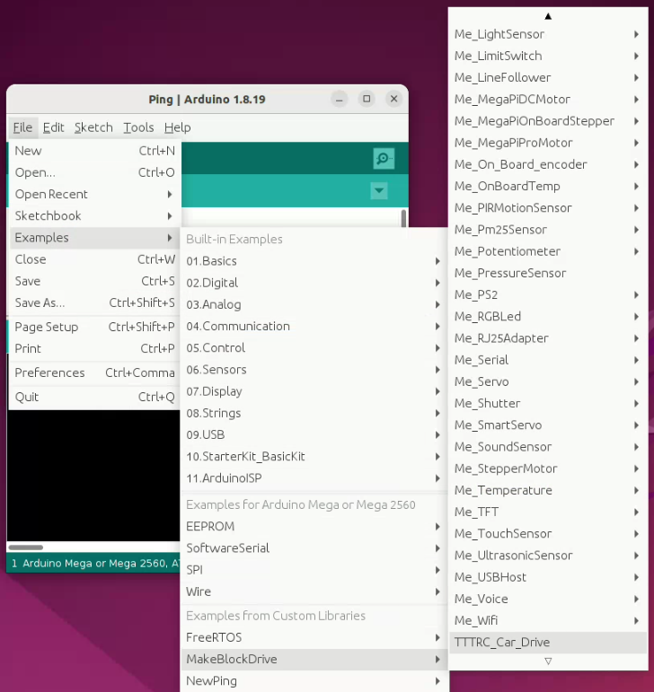
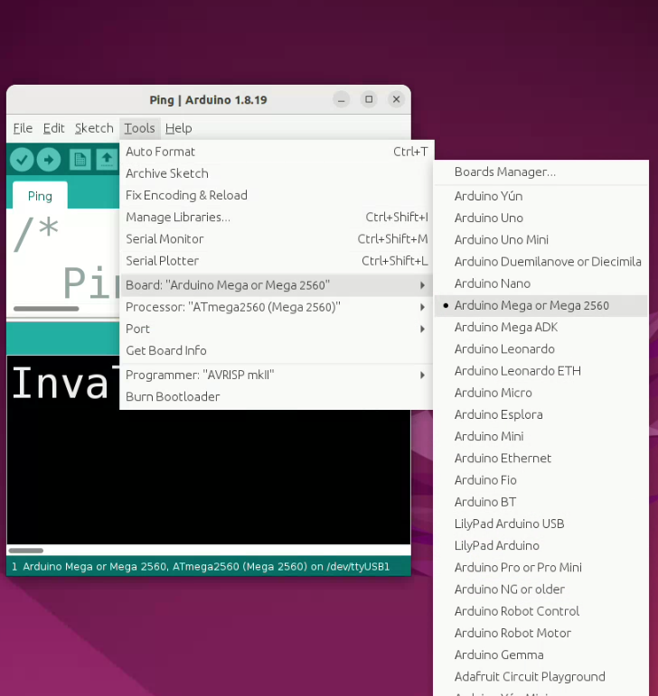

# Makeblock Library v3.27

Arduino Library for Makeblock Electronic Modules

# Copyright notice

In makeblock's library, some of the modules are derived from other open source projects, and also part of some code is inspired by the algorithms of other individuals or organizations. We will retain the copyright of the original open source code.

These modules is derived from other open source projects:

- MeRGBLed
- MeHumitureSensor
- Me7SegmentDisplay
- MeOneWire
- MeStepper

and these modules is inspired by some projects:

- MeUSBHost

As an open source library, we respect all contributors to the open source community and thank you very much for everyone's supervision.

If you have a discussion about licensing issues, please contact me (myan@makeblock.com -- Mark Yan)

### How to use @TTTRC
To use this code, we want to have it into our workspace, to be able to edit the content via VS Code

But we also want it in the Arduino IDE.

For this follow this instruction
```
cd ~/workspace
gh repo clone TTTRC-Robotics/Makeblock-Libraries
```

Then we want to create a simlink into Arduino folder
```
cd ~/Arduino/libraries
ln -s ~/workspace/Makeblock-Libraries Makeblock-Libraries
```

To verify that it is working:
```
ll ~/Arduino/libraries

lrwxrwxrwx 1 $USER $USER   49 Oct dd hh:mm Makeblock-Libraries -> /home/$USER/workspace/Makeblock-Libraries/
```



Now you will want to compile the code

First select the right board. (Arduino MEGA or MEGA 2560)




### __ORIGINAL HOW TO__ How to use:

1. Download the source from the git https://codeload.github.com/Makeblock-official/Makeblock-Libraries/zip/master

2. In the Arduino IDE: "Sketch-> Include Library-> Add .ZIP Library-> select the downloaded file-> Open"

3. Click "File-> Examples". There are some test programs in "MakeBlockDrive->"

4. Depending on the type of board you're using, you need to modify the header file to match.

   For example, if you're using a mCore. You should change `#include <MeOrion.h>` to `#include <MeMCore.h>`
   Corresponding boards and there header file are:

   Orion <-------->  MeOrion.h

   BaseBoard <---->  MeBaseBoard.h

   mCore <-------->  MeMCore.h

   Shield <------->  MeShield.h

   Auriga <------->  MeAuriga.h

   MegaPi <------->  MeMegaPi.h

### Revision of history:

|Author      |       Time      |   Version    |    Descr     |
|:--------   |      :-----:    |   :----:     |    :-----    |
|Mark Yan    |     2015/07/24  |   3.0.0      |    Rebuild the old lib.|
|Rafael Lee  |     2015/09/02  |   3.1.0      |    Added some comments and macros.|
|Lawrence    |     2015/09/09  |   3.2.0      |    Include some Arduino's official headfiles which path specified.|
|Mark Yan    |     2015/11/02  |   3.2.1      |    fix bug on MACOS.|
|Mark Yan    |     2016/01/21  |   3.2.2      |    fix some library bugs.|
|Mark Yan    |     2016/05/17  |   3.2.3      |    add support for MegaPi and Auriga Board.|
|Mark Yan    |     2016/07/27  |   3.2.4      |    fix some JIRA issue, add PID motion for Megapi/Auriga on board encoder motor.|
|Mark Yan    |     2018/05/16  |   3.2.5      |    Correct copyright information.|
|Vincent He  |     2019/01/04  |   3.2.6      |    1.Mbot /ranger adds the function of communication variables. 2.Solve the blocking problem of 9g steering gear. 3.Solve the problem that the intelligent steering gear cannot read back the parameters. 4.Add version number function. 5.High power code motor reinforcement version query function. 6.Solve the problem of SetColor (uint8_t index, long value) function error in mergharp.cpp. 7.The mBot board cannot extinguish the RGB. First upload the program with the RGB in any color, and then upload the program with the RGB in all colors. The RGB cannot extinguish (MeRGBLed bled. CPP file). 8.In the MegaPi firmware, SLOT1 is changed to slot_num instead of parameter transmission in the command processing stepper motor.|
|Vincent He  |     2019/09/02  |   3.2.7      |    1.fix the problem that the electronic compass Mecompass is hung on the Orion mainboard 7 or 8 ports and communication will be hung dead. 2.fix the problem that the function getPointFast() in MeHumitureSensor.cpp does not normally output the value. 3.fix the problem that compile smartservo_test.ino firmware error report using the arduino1.6.5 environment with mBlock V3.4.12. 4.remove MeSuperVariable.cpp/MeSuperVariable.h. 5.fix the problem that ultrasonic module can only measure the maximum range of 375cm,and the maximum range of normal requirements is 400cm.|

### Learn more from Makeblock official website: www.makeblock.com
